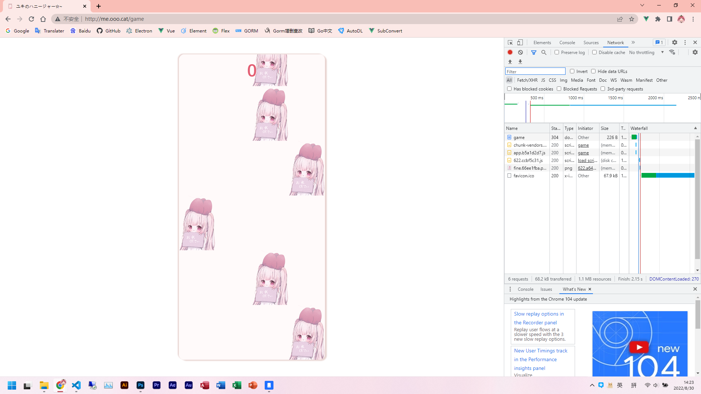

# Eat It~~（其实是还没想好名字）~~
#### 有点像《别踩白块儿》的H5小游戏。拆包可部署，轻巧易修改。  
  

## 📷预览

## ✨灵感  
> 记得几年前玩过一个叫[《吃掉小鹿乃》](https://xingye.me/game/eatkano/index.php)的H5小游戏，有点像别踩白块儿。时隔久远，本以为早就找不到原站了，于是就凭印象闷头重写了一个，权作消遣。没想到上Github一搜，原作竟然还是[开源的](https://github.com/arcxingye/EatKano)...  

## 😋特色  
+ 静态编译（或[下载发布包](https://github.com/YukiChiyoda/EatIt/releases/tag/v1.0)）后即可直接部署使用
+ 直接覆盖编译后对应静态图片文件即可改图
+ 动画控制较流畅，页面设计观感尚佳

## ❤️素材
+ 默认素材图来自[Pixiv](https://www.pixiv.net/artworks/88456841)，画师[甘目もな](https://www.pixiv.net/users/57906184)  

## 🎉链接  
[🚀在喵的博客中体验](http://me.ooo.cat/game)  
[🏠喵的博客前端仓库](https://github.com/YukiChiyoda/Jar)  